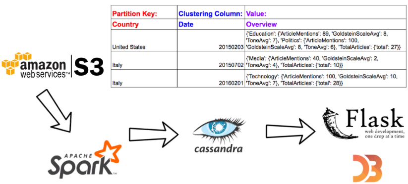

# Global Watch

Insight Data Engineering 
Silicon Valley Session 2017A 

##Introduction
Global Watch is a tool designed to quickly give users insight to past global trends for every country in the world. I am using data
from The GDELT Project, which uses a massive inventory of the world's news media to perform real-time monitoring of every
accessible print, broadcast, and online news report around the globe. Through the tool I created anyone can travel back in time till
1979 and find and understand news patterns for different countries in the world.

##Motivation
My family is originally from Ecuador and I grew up watching an international Ecuadorian news channel and Univision,
a broadcast telivision network that targets Latino Americans. In addition to watching news in Spanish, I also
read and watch American news. Throughout my life I have noticed the difference that exists in the kinds of news
people get based on the country they live in. Due to the limited variety of news we receive at home, we unconsciously
place ourselves in a bubble and are only aware of what is relevant to our home country. My main goal for the Insight Data
Engineering Project was to create a tool that would allows users to quickly zoom out of the bubble and understand from
a global perspective what is important to other countries in the world.

##What does my project do?
###Supported Queries
A user can query news for a specific day, month, or year for any given country.

###Data Source
~100GB of event data from Events 1.0, a dataset part of The GDELT Project. (https://aws.amazon.com/public-datasets/gdelt/)

##Pipeline

